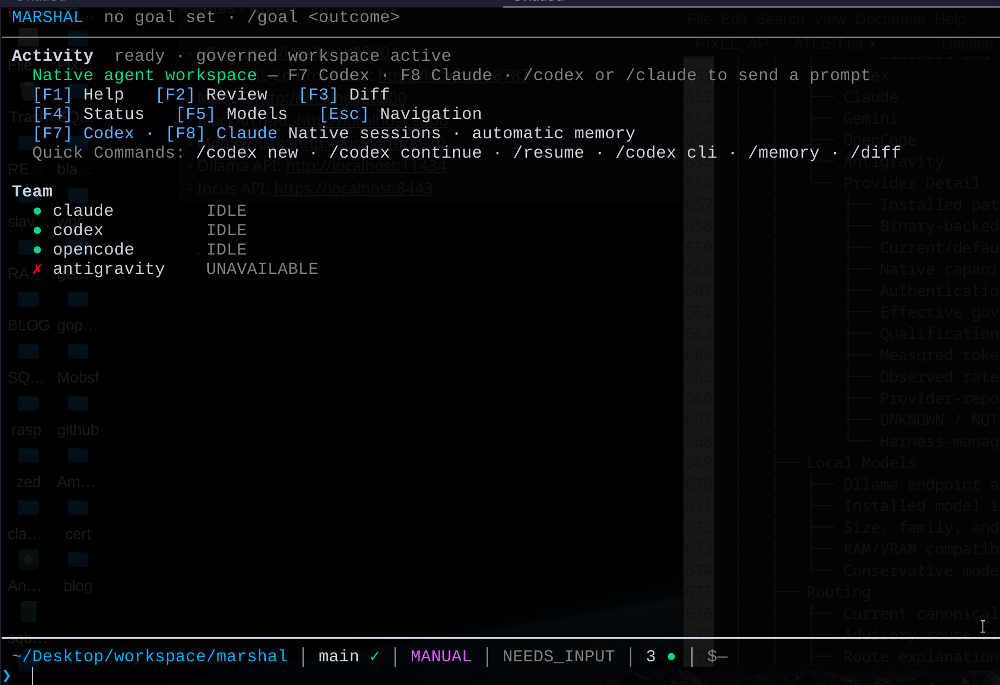

<div align="center">

# MARSHAL

### One workspace for every coding agent you use.

**Claude Code, Codex, OpenCode and more in the same project, sharing one memory,
running in sandboxed cells, with a record of everything they did.**

[](https://github.com/Zen1th53/marshal/actions/workflows/ci.yml)
[](https://github.com/Zen1th53/marshal/releases)
[](https://go.dev)
[](LICENSE)
[](#requirements)
[](https://github.com/Zen1th53/marshal/stargazers)

```bash
curl -fsSL https://raw.githubusercontent.com/Zen1th53/marshal/main/install.sh | sh
```

[Quick start](#quick-start) ·
[Features](#features) ·
[Security](#security-you-do-not-have-to-configure) ·
[Docs](#documentation) ·
[Limitations](#limitations)

<br>



<sub>The MARSHAL workspace: your agent team, one keypress per agent, and a status line that always tells the truth.</sub>

</div>

---

## Why MARSHAL?

You run Claude Code in one terminal and Codex in another. Each keeps its own
history, so neither knows what the other changed. When a session ends, its
reasoning ends up in scrollback you will never read again. Both agents also edit
your repository with your full privileges, and nothing sits between them and the
disk.

**MARSHAL sits between them.** It is a local control plane that runs agents in
sandboxed cells, records what they actually do, and lets each agent build on the
others' work.

<table>
<tr>
<td width="33%" valign="top">

### 🧠 Shared memory
Every conversation, tool call and diff is saved automatically and can be
searched across agents and across sessions.

</td>
<td width="33%" valign="top">

### 🤝 Agents that cooperate
Codex starts out knowing what Claude just changed, and Claude knows what Codex
changed. A live inbox keeps parallel sessions up to date.

</td>
<td width="33%" valign="top">

### 🛡️ Fail-closed security
Agents run in sandboxed cells on their own worktrees, and secrets are redacted.
If a boundary can't be enforced, the run stops.

</td>
</tr>
</table>

> **Everything stays on your machine.** MARSHAL uploads nothing, and nothing runs
> unless you ask for it.

---

## At a glance

| | Running agent CLIs by hand | **With MARSHAL** |
|---|:---:|:---:|
| Several agents in one project | separate silos | ✅ one workspace |
| Memory across sessions and agents | ❌ | ✅ automatic, searchable |
| Agent B knows what agent A changed | ❌ | ✅ briefing and live inbox |
| Sandboxed execution | ❌ | ✅ Bubblewrap cells |
| Isolated Git worktree per run | ❌ | ✅ |
| Secrets kept out of stored history | ❌ | ✅ redacted before writing |
| Verifiable record of what changed | ❌ | ✅ content-addressed evidence |
| Native agent UX (your config, auth, skills, MCP) | ✅ | ✅ unchanged, not proxied |

---

## Features

### 🖥️ One workspace, every agent

```bash
marshal tui
```

| Key / command | What it does |
|---|---|
| `F8` · `/claude` | Open a native **Claude Code** session |
| `F7` · `/codex` | Open a native **Codex** session |
| `/claude continue` · `/codex continue` | Pick up where the agent left off |
| `/codex new` · `/resume` · `/codex cli` | Start fresh, resume, or open the plain CLI |
| `F1` Help · `F2` Review · `F3` Diff | Help, review, and the working-tree diff viewer |
| `F4` Status · `F5` Models · `F6` MCP | Runtime state, models, MCP servers |
| `Ctrl+P` | Fuzzy command palette over every capability |
| `/goal <outcome>` | Set the session objective shown in the header |

Sessions are **native**. Claude Code runs as Claude Code, with your configuration,
authentication, skills, MCP servers, plugins and its own permission prompts.
MARSHAL doesn't proxy the provider, rewrite prompts, or get between you and the
agent. Adapters also ship for **OpenCode**, **Gemini CLI** and **Antigravity**.

The **Team** panel shows the real status of every harness. Each binary is
actually probed, so a missing agent shows as `UNAVAILABLE` and is never faked.

Once you leave an agent, switching to another takes one keypress. With two
terminals open, Claude and Codex can run **at the same time** in the same
repository. They share one project memory, and each keeps its own import state,
so they don't interfere with each other.

<details>
<summary><b>Keyboard-first workspace details</b></summary>

- **Contextual autocomplete**: `/` for commands (fuzzy, e.g. `/rb` → `/rollback`),
  `@` for live agents, `#` for claim, evidence, task and checkpoint IDs.
- **`Tab` never submits.** It only completes. `Enter` runs the command.
- **Safe paste**: pasted newlines never execute anything. Large pastes collapse to
  `[Pasted text #1 +42 lines]` and are restored exactly when you submit.
- **Diff viewer**: colored unified diffs with secret redaction. Use `n`/`p` to
  move between hunks.
- **Real terminal app**: the alternate screen repaints in place, and your
  scrollback is restored exactly as it was when you exit.
- **Safe interrupt**: `Ctrl+C` closes overlays, then clears the input. Only a
  second press exits.
- **Status line**: shows path, branch and cleanliness, working mode, session
  state, active agents and budget.

See the [workspace guide](docs/tui.md) for the full command reference.
</details>

### 🧠 Memory that saves itself

You never have to save anything. From the moment an agent starts, MARSHAL writes
to the project database every two seconds, and again when the agent exits:

- **the conversation**: what you asked and what the agent answered
- **every tool call**: the commands it ran and the files it opened
- **the code it wrote or deleted**, stored as a complete diff rather than a
  summary

You can then search it across agents and over time:

```bash
/memory search watcher      # in the workspace
marshal memory recall ...   # or from the shell
```

**Never stored:** the model's hidden reasoning, or any credential. Secrets are
redacted before anything is written. Tool output is size-limited so one huge
dump can't crowd out the rest of the record, and truncated output is always
marked as truncated.

Records are kept as **observations, not verified facts**. MARSHAL shows where
each one came from, so an agent's guess is never presented as settled fact.

### 🤝 Agents that build on each other

*This is what you can't get by running the CLIs yourself.*

When an agent starts, it gets a **briefing** built from what the *other* agents
have already done in the project: recent sessions, the commands they ran, and the
changes they made. Codex starts out knowing what Claude just did, and vice versa.

A briefing is only a snapshot, so MARSHAL keeps it current. While a session runs,
MARSHAL watches the other agents and appends their work to a **live inbox** that
the running agent can read (`.marshal/inbox/<agent>.md`). Two agents working in
parallel can keep up with each other without you passing messages between them.

The briefing and the inbox both label themselves as **untrusted data, not
instructions**. They quote other agents' output, which can contain anything those
agents happened to read, and nothing in them overrides you.

### 🛡️ Security you do not have to configure

- **Sandboxed execution.** Agent processes run in isolated cells with a read-only
  root filesystem, private runtime directories, and no network by default.
- **Isolated worktrees.** Each run works on its own Git worktree and branch. Your
  working tree is never used for experiments.
- **Fail closed.** If a boundary can't be enforced, the run stops instead of
  continuing without the policy.
- **Secrets never reach storage.** Credentials are redacted from stored output
  and never enter long-term memory.
- **Nothing starts by accident.** Plain text in the workspace runs nothing. If
  you type a command without its slash, MARSHAL suggests the command you probably
  meant. An agent starts only when you ask for it by name.
- **Delegation must be earned.** To let MARSHAL act without asking each time,
  the session needs a cryptographically verified entitlement. A local flag can't
  grant it, and the test suite includes bypass attempts that must fail.

### 🔍 Evidence you can check later

Command output and artifacts are content-addressed and linked to the commit that
produced them. When you ask "what did this run actually change?", you get an
answer you can verify, not a log you have to take on trust.

- **Claims and evidence**: `/claims`, `/evidence` and `/inspect` show what was
  asserted, what backs it up, and any contradictions.
- **Checkpoints and rollback**: `/checkpoint` and `/rollback` save and restore
  the worktree together with its claim state.
- **Approvals**: `/approvals`, `/approve` and `/reject` handle high-risk actions,
  each tied to a specific commit.
- **Evidence bundles**: `/export` writes a bundle with a deterministic digest to
  `.marshal/evidence/`.

### 🧭 A governed lifecycle, from goal to attestation

For work that needs more than a chat session, MARSHAL provides a governed
pipeline. Each stage writes a versioned record tied to an exact repository state,
and no command can mark a stage successful directly.

```bash
marshal goal "add rate limiting to the API"   # intent, hard constraints, risk tier
marshal plan create ...                        # task DAG, team, verification policy
marshal exec start ...                         # governed run with approval gates
marshal review start ...                       # independent verification + attestation
marshal learning search ...                    # memory filtered by evidence
```

Exiting with status zero doesn't make a run verified. Completion requires every
mandatory criterion to be met and critical evidence from independent sources.

### 🔌 Integrations

- **MCP server** (`marshal mcp serve`): an authenticated
  [Model Context Protocol](docs/mcp.md) endpoint for IDEs and orchestrators.
- **A2A server** (`marshal a2a serve`): the [Agent-to-Agent](docs/a2a.md)
  protocol, for discovery and safe task delegation.
- **Bearer tokens** (`marshal auth token create | list | revoke`) protect both
  servers. Neither starts unless you run it.

---

## Architecture

<div align="center">

</div>

For details, see [architecture](docs/architecture.md),
[execution cells](docs/execution-cells.md) and the
[security model](docs/security-model.md).

---

## Install

**Linux, one command:**

```bash
curl -fsSL https://raw.githubusercontent.com/Zen1th53/marshal/main/install.sh | sh
```

The script finds the latest release, checks the download against its published
checksums, and installs to `~/.local/bin`. It needs no `sudo` and touches nothing
outside the install directory. If verification fails, nothing is installed.

```bash
# Choose the location, or pin a version
MARSHAL_INSTALL_DIR=/usr/local/bin MARSHAL_VERSION=v0.0.1 \
  sh -c "$(curl -fsSL https://raw.githubusercontent.com/Zen1th53/marshal/main/install.sh)"
```

<details>
<summary><b>From a release archive</b></summary>

The archive and `checksums.txt` are on the
[latest release](https://github.com/Zen1th53/marshal/releases/latest):

```bash
sha256sum -c checksums.txt --ignore-missing
tar -xzf marshal_<version>_linux_amd64.tar.gz
install -Dm755 marshal "$HOME/.local/bin/marshal"
```
</details>

<details>
<summary><b>From source</b> (requires Go and <code>git</code>)</summary>

```bash
go install github.com/Zen1th53/marshal/cmd/marshal@latest
```
</details>

---

## Quick start

```bash
cd /path/to/your/repository

marshal init        # create the project runtime
marshal doctor      # check the host and probe the agent CLIs you have installed
marshal tui         # open the workspace
```

Then, in the workspace:

```
/goal <outcome>             say what you are trying to achieve
/claude                     work with Claude Code (or press F8)
                            ...exit the agent when you are done
/codex                      hand over to Codex (F7); it already knows what changed
/memory search <anything>   ask the project what happened
/diff                       review the working tree
```

---

## Modes

```
/mode manual     the default working mode
/mode auto       switch the session's working mode
/mode ultra      refused without a verified entitlement
/ultra           why this session is Standard, and how to ask for more
```

`manual` and `auto` are **session preferences**. They are recorded and shown in
the status line, but on their own they don't allow anything to act without you.

Autonomous delegation, where MARSHAL decides instead of asking each time,
requires a cryptographically verified entitlement. That check runs on every
attempt; it isn't cached at startup. A local setting can't grant it, and
`/mode ultra` without an entitlement is refused. Without one, the session runs as
Standard and keeps asking you, which is intended behavior and not a degraded
mode.

---

## Requirements

| | |
|---|---|
| **Linux** | The supported platform for sandboxed execution. MacOS and Windows have no equivalent backend. |
| **Bubblewrap** (`bwrap`) | Required for execution cells. |
| **Git** | MARSHAL works on a Git repository. |
| **Agent CLIs** | Install and log in to the ones you want. MARSHAL doesn't bundle or proxy any of them. |

Run `marshal doctor` to see what is installed and what is missing.

---

## Limitations

These are stated plainly, because a control plane that overstates its guarantees
is worse than none:

- **Network egress isn't filtered per destination.** Runs that need network
  access stop instead of proceeding without the policy.
- **Sandboxed execution is Linux only.**
- **One agent per terminal.** A native session takes over its terminal, so
  running two agents at once needs two terminals.
- **Vector search needs an embedding provider.** Exact and lexical search work
  without one.
- **No third-party security audit.** Automated suites test the security
  invariants, but that isn't external certification.

---

## Documentation

| | |
|---|---|
| [Getting started](docs/getting-started.md) | Step-by-step tutorial |
| [Workspace guide](docs/tui.md) | Native sessions, memory capture, cross-agent exchange, all commands |
| [CLI reference](docs/cli.md) | Every command |
| [Security model](docs/security-model.md) | Threat model and isolation boundaries |
| [Providers](docs/providers.md) | Supported agent CLIs and configuration |
| [MCP](docs/mcp.md) · [A2A](docs/a2a.md) | Protocol servers |
| [Troubleshooting](docs/troubleshooting.md) | Diagnostics and recovery |
| [Documentation hub](docs/README.md) | Everything else |

---

## Community and Enterprise

MARSHAL Community is a local, single-node runtime scoped to one project, and it
is everything in this repository. Enterprise adds a remote web control plane,
orchestration across multiple nodes, centralized approvals, and multi-user access
control under a separate commercial license. The Community binary doesn't
include a web control plane.

---

## Contributing

Issues and pull requests are welcome. Please read
[CONTRIBUTING.md](CONTRIBUTING.md) and [CODE_OF_CONDUCT.md](CODE_OF_CONDUCT.md)
first.

To report a security vulnerability, follow [SECURITY.md](SECURITY.md) and report
it privately rather than opening a public issue.

If MARSHAL is useful to you, **a ⭐ helps other people find it.**

---

## License

- **Community**: GNU Affero General Public License v3.0 only. See [LICENSE](LICENSE).
- **Commercial**: licenses without AGPL copyleft are available. See
  [LICENSING.md](LICENSING.md).
- **Historical releases** up to `runtime-v0.4.0` remain under their original
  Apache-2.0 grants. See [docs/legal/LICENSE-HISTORY.md](docs/legal/LICENSE-HISTORY.md).
- **Third-party** attributions: [THIRD_PARTY_NOTICES.md](THIRD_PARTY_NOTICES.md).
