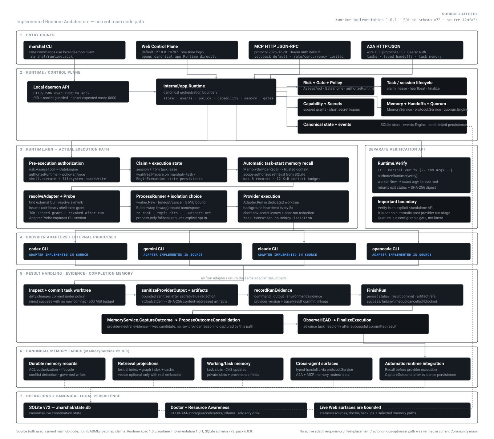

# MARSHAL

[](https://github.com/Zen1th53/marshal/actions/workflows/ci.yml)
[](https://github.com/Zen1th53/marshal/releases)
[](https://go.dev)
[](LICENSE)

MARSHAL is a local, security-focused runtime and control plane for coding agents. It coordinates tasks, sessions, and agents while enforcing capability grants, policy rules, execution sandboxing, content-addressed evidence, and durable memory inside one auditable project runtime.

Raw provider CLIs can modify files and execute arbitrary commands, but they lack independent authorization boundaries, reproducible worktree isolation, verifiable evidence graphs, and governed cross-turn memory. MARSHAL wraps provider execution inside isolated execution cells, leases and records state in a canonical local SQLite database, and fails closed whenever a requested security or isolation boundary cannot be enforced.

Current Community release: **v1.0.1** · SQLite schema: **v72** · Pack version: **6.0.0**.

---

## Why MARSHAL?

Autonomous and assistive coding agents are increasingly granted direct access to developer machines and repositories. Running external agent CLIs directly introduces critical security and reproducibility challenges:

1. **Unbounded Shell & Filesystem Execution**: Raw agent tools run with full user privileges across the entire host filesystem and network, risking accidental file destruction or unauthorized access.
2. **Ephemeral Coordination State**: When an agent finishes a task, its decisions, shell outputs, and error contexts are scattered across terminal scrollbacks or transient log files rather than captured in an auditable ledger.
3. **No Independent Authorization Boundary**: An LLM cannot reliably police its own actions. Security policy, capability grants, and risk evaluation must be enforced by an independent runtime before command execution.
4. **Context Amnesia & Memory Drift**: Multi-step engineering workflows require durable memory that tracks previous task outcomes, conflicts, and architectural decisions without exceeding context budgets or ingesting unverified prompt injections.

MARSHAL solves these challenges by acting as a **deterministic local control plane** between agent interfaces (CLI, Web, MCP, A2A) and provider execution backends.

---

## What MARSHAL Actually Provides

| Subsystem | Current Community v1.0.1 Capability |
|---|---|
| **Runtime Control Plane** | Project-local daemon over a mode-`0600` Unix domain socket (`.marshal/runtime.sock`), atomic task claims, 15-minute heartbeated session leases, dedicated Git worktrees (`marshal/<task>`), and model context protocol servers. |
| **Security & Policy** | Capability broker with fine-grained time-bounded grants, role authorization (`orchestrator`, `architect`, `developer`, `qa`, `appsec`), pre-execution risk gates (`R0`..`R3`), secrets lease/redaction engine, and deny-by-default network policy. |
| **Execution Sandboxing** | Linux Bubblewrap (`bwrap`) mount namespaces with read-only root filesystems, minimal config binds, tmpfs runtime directories, network unsharing (`--unshare-net`), 500 MiB worktree disk budget, and 8 MiB output bounds. |
| **Canonical Memory Fabric** | SQLite-backed memory engine (schema `v72`), automatic task-start context recall (max 8 records, 12 KiB budget), post-run evidence-linked outcome capture (`CaptureOutcome`), multi-track search (exact, lexical, graph; optional vector), conflict detection, lifecycle governance, and session importers (Claude, Codex, OpenCode). |
| **Provider Adapters** | Modular process adapters for Codex CLI, OpenCode, Gemini CLI, and Claude Code with dynamic capability probing and standardized execution contracts. |
| **Evidence & Provenance** | Content-addressed SHA-256 artifact storage (`.marshal/artifacts/sha256/<hex>`), structured command/output/environment evidence nodes, commit linkage, and immutable event ledger. |
| **Community Resource Awareness** | Bounded, read-only host telemetry covering CPU/cgroups, RAM/swap, storage, GPUs/accelerators (with `SHARED_OR_UNKNOWN` handling), thermals, and local Ollama model inventory with conservative concurrency advice. |
| **Operations & Web UI** | Authenticated loopback Web control plane (`127.0.0.1:8787`), single-use one-time login codes, system health diagnostics (`marshal doctor`), SQLite backup/restore verification, and legal chain-of-title compliance export. |

---

## Architecture

The following diagram illustrates the implemented Community runtime architecture derived directly from current executable code:



### Architecture Layers

1. **Entry Points**: Operators and tools interact with MARSHAL through the native `marshal` CLI, the loopback Web Control Plane (`127.0.0.1:8787`), the MCP HTTP JSON-RPC endpoint (protocol `2026-07-28`), or the A2A HTTP/JSON endpoint (wire `1.0`, protocol `1.0.0`).
2. **Runtime / Control Plane**: `internal/app.Runtime` coordinates operations over the local daemon socket. It orchestrates risk assessment (`internal/risk`), pre-execution security gates (`internal/gate`), capability brokering (`internal/capability`), role-based policy enforcement (`internal/policy`), and the canonical SQLite store (`internal/store`).
3. **Execution Pipeline**: `Runtime.Run` handles task claims, prepares an isolated Git worktree, performs automatic task-start memory recall, resolves provider binaries, and executes the provider inside a Bubblewrap container. `Runtime.Verify` provides a separate, explicit command verification API.
4. **Provider Adapters**: External provider CLIs (`codex`, `gemini`, `claude`, `opencode`) run against standardized process interfaces (`adapter.Adapter`).
5. **Result Handling & Evidence**: Provider output is sanitized and redacted; dirty worktree changes are committed under policy; stdout/stderr artifacts are stored with SHA-256 addressing; run evidence nodes are recorded; and completion outcomes are captured into memory.
6. **Canonical Memory Fabric**: `MemoryService` (v2.0.0) maintains durable memory records, working task slots, multi-track search projections (exact, lexical, graph), access control, and cross-agent handoffs.
7. **Operations & Persistence**: SQLite schema `v72` (`.marshal/state.db`) serves as the single source of truth for coordination state, task leases, audit ledgers, and evidence graphs.

---

## How a Task Actually Executes

Every task executed via `marshal run <TASK-ID> --adapter <ADAPTER>` follows an explicit, fail-closed sequence implemented in `internal/app/runtime.go`:

```text
[Operator / API Request]
          │
          ▼
1. Pre-Execution Authorization ────► risk.AssessTool ──► GateEngine.Evaluate ──► policy.Enforce
          │
          ▼
2. Atomic Task Claim ─────────────► Store.Claim (15m lease) ──► worktree.Prepare (.marshal/worktrees/<task>)
          │
          ▼
3. Automatic Memory Recall ───────► MemoryService.Recall (max 8 records, 12 KiB budget injected into context)
          │
          ▼
4. Adapter Resolution & Probing ──► resolveAdapter ──► issue 30m exact-binary grant ──► Adapter.Probe
          │
          ▼
5. Sandboxed Process Run ─────────► worker.NewSandboxed (bwrap: ro root, tmpfs dirs, --unshare-net)
          │
          ▼
6. Output Redaction & Worktree ───► auth.RedactSecrets ──► worktree.Inspect ──► git commit under policy
          │
          ▼
7. Artifact & Evidence Storage ───► artifact.Store.Put (SHA-256) ──► recordRunEvidence (command/output/env)
          │
          ▼
8. Completion Memory Capture ─────► MemoryService.CaptureOutcome ──► ProposeOutcomeConsolidation
          │
          ▼
9. Finalization & Coordination ───► Store.ObserveHEAD ──► Store.FinalizeExecution ──► Revoke temporary grants
```

### Key Execution Invariants

- **Fail-Closed Gate Checks**: If pre-execution risk assessment or security gates fail, the run aborts immediately before any worktree preparation or binary invocation.
- **Dedicated Git Worktree**: Execution occurs strictly inside `.marshal/worktrees/<task>` on branch `marshal/<task>`, protecting the working tree.
- **Commit Requirement**: A successful run must produce a verifiable git commit; runs that exit zero without changes or commits are rejected.
- **Worktree Disk Budget**: Task worktrees are bound to a strict 500 MiB disk budget; exceeding this limit fails the run.
- **Automatic Memory Recall & Capture**: Before execution, up to 12 KiB of scope-authorized memory is recalled and injected into trusted provider context. After execution, outcome metadata (success status, error digests, files changed, and retry conditions) is captured into durable memory.
- **Standalone Verification API**: `Runtime.Verify` (`marshal verify [-- cmd args...]`) is an explicit verification command that runs an exact argv in the repository root with a 15-minute timeout and computes SHA-256 output digests. It is not an automatic post-provider run stage.

---

## Canonical Memory Fabric (v2.0.0)

MARSHAL includes a multi-track memory fabric designed for multi-turn agent coordination and organizational learning.

```text
       ┌─────────────────────────────────────────────────────────┐
       │                SQLite v72 (.marshal/state.db)           │
       │                   CANONICAL SOURCE OF TRUTH             │
       └────────────────────────────┬────────────────────────────┘
                                    │
        ┌───────────────────────────┼───────────────────────────┐
        ▼                           ▼                           ▼
 ┌──────────────┐            ┌──────────────┐            ┌──────────────┐
 │ Exact Match  │            │   Lexical    │            │  Code Graph  │
 │  (Key/Hash)  │            │  (BM25/FTS)  │            │ (Adjacency)  │
 └──────────────┘            └──────────────┘            └──────────────┘
        │                           │                           │
        └───────────────────────────┼───────────────────────────┘
                                    ▼
       ┌─────────────────────────────────────────────────────────┐
       │          Scope-Authorized & ACL-Enforced Fusion         │
       └────────────────────────────┬────────────────────────────┘
                                    │
               ┌────────────────────┴────────────────────┐
               ▼                                         ▼
   [Automatic Task-Start Recall]             [Post-Run Outcome Capture]
   12 KiB budget / 8 max records             Evidence-linked candidates
```

### Memory Capabilities

- **Canonical State vs Projections**: SQLite schema `v72` is the sole canonical persistence layer. Lexical indices, graph indices, and retrieval caches are disposable in-memory projections rebuilt on demand.
- **Multi-Track Search**: Retrieval combines exact key matching, lexical search (BM25/FTS), and graph traversal. Vector similarity search is optional and activates only when a real local embedding provider is configured.
- **Scope & ACL Enforcement**: Every memory record carries strict project, task, agent, or branch scopes. Agents can only recall records matching their authorized principals.
- **Conflict Detection & Governance**: Conflicting memory updates trigger deterministic conflict records requiring operator review or policy promotion (`marshal memory promote`).
- **Working / Task Memory**: Fast task-scoped slots with Compare-And-Swap (CAS) atomic updates for in-progress agent reasoning.
- **Session Importers**: Built-in importers parse and structure historical sessions from Claude, Codex, and OpenCode formats into governed memory records.

---

## Security and Isolation Model

MARSHAL implements defense-in-depth principles:

### 1. Unix Domain Socket & Filesystem Permissions
- The local daemon listens on `.marshal/runtime.sock` with file mode `0600` (accessible exclusively by the owner).
- The project runtime directory `.marshal/` is initialized with mode `0700`.
- All mutation endpoints verify client process identity (UID/GID matching).

### 2. Linux Bubblewrap (`bwrap`) Execution Cells
- Provider CLI processes run inside unprivileged Linux user and mount namespaces.
- The host root filesystem is mounted strictly read-only (`--ro-bind / /`).
- Minimal required configuration files (e.g., `~/.codex/auth.json`) are explicitly bound read-only; general user home directories are not exposed.
- Dedicated tmpfs directories are mounted for provider caches, local storage, and logs (`/home/marshal/.cache`, `/home/marshal/.local`).
- Process-only (unsandboxed) execution is disabled by default and requires explicit opt-in (`AllowProcessOnlyFallback`), restricted strictly to low-risk `R0`/`R1` tasks.

### 3. Deny-by-Default Network Policy
- Sandboxed execution cells invoke Bubblewrap with `--unshare-net` to isolate network access completely.
- Because Bubblewrap toggles networking entirely and cannot enforce host/port allowlists on its own, endpoint-restricted network requests fail closed with `NET_ENFORCEMENT_UNAVAILABLE` until an enforcing proxy is wired.

### 4. Secrets Boundary & Automatic Redaction
- API tokens (`OPENAI_API_KEY`, `ANTHROPIC_API_KEY`, `GEMINI_API_KEY`, etc.) are leased with short 5-minute expirations and revoked immediately after execution.
- High-entropy secrets and leased values are automatically stripped from stdout, stderr, event payloads, and artifact reports before persistence.

### 5. Web Control Plane Security
- The Web server binds to loopback (`127.0.0.1:8787`) by default. Binding to non-loopback interfaces requires explicit opt-in.
- Authentication uses short-lived (5-minute), single-use one-time login codes generated via `marshal web code`.
- All state-modifying requests require valid session cookies and CSRF tokens with strict Content Security Policy (CSP) headers.

---

## Provider Adapters and Verification Status

MARSHAL includes process adapters for major agent CLIs. Adapters probe provider binaries dynamically and distinguish between implementation, availability, and end-to-end verification.

| Provider Adapter | Runtime Adapter | Release Probe Status | Adapter / Model E2E | Canonical Runtime E2E |
|---|:---:|---|---|---|
| **Codex** (`codex`) | Yes | PASS (`codex-cli 0.149.1`) | NOT_RUN — credentialed run not enabled | NOT_RUN |
| **OpenCode + DeepSeek V4** (`opencode`) | Yes | PASS (`opencode 1.18.16`) | PASS — Flash (7.01s) & Pro (6.64s) | NOT_RUN — enforcing egress proxy unavailable |
| **OpenCode + Local Ollama** (`opencode`) | Yes | PASS (`ollama 0.32.9`) | FAIL — tested local models did not satisfy proof task | NOT_RUN — enforcing egress proxy unavailable |
| **Gemini CLI** (`gemini`) | Yes | NOT_AVAILABLE — binary absent on release host | NOT_RUN — binary unavailable | NOT_RUN |
| **Claude Code** (`claude`) | Yes | PASS (`claude 2.1.198`) | NOT_RUN — credentialed run not enabled | NOT_RUN |

> **Verification Policy**: "Adapter Implemented" means the codebase contains a tested process adapter. External provider tests require installed binaries, valid credentials, or running local models. Tests that are skipped or not run are never reported as verified.

---

## Web Control Plane

MARSHAL includes an embedded, authenticated Web control plane for monitoring and managing local agent operations.

```bash
# Start the Web Control Plane
marshal web serve

# Generate a single-use one-time login URL
marshal web code
```

### Live-Backed Surfaces vs Unsupported Surfaces

- **Live Canonical Surfaces**: System status, task lists, run details, stdout/stderr execution logs, content-addressed artifacts, evidence graphs, audit event timelines, memory search and governance, doctor diagnostics, and SQLite database backup management.
- **Fixture-Only / Unsupported Surfaces**: Routes backed only by mock data or speculative enterprise features (such as autonomous multi-model routing or fixture overviews) return `501 Not Implemented` (`unsupported_live_surface`) when connected to a live runtime.

---

## Community Resource Awareness

MARSHAL includes a bounded, read-only host resource inspector that gathers point-in-time system telemetry:

- **Host Metrics**: CPU model, logical and effective cores, cgroup CPU quotas, total/available RAM, swap usage, and disk storage.
- **Accelerators & GPUs**: GPU vendor, model, total/used VRAM, temperature, and memory semantics. Shared or integrated GPU memory is accurately reported as `SHARED_OR_UNKNOWN` rather than assumed to be zero.
- **Local Ollama Discovery**: Probes loopback Ollama instances (`http://127.0.0.1:11434`), catalogs installed models, and evaluates compatibility against available system RAM.
- **Advisory Guidance**: Generates conservative concurrency and model fit recommendations.

> **Community Boundary**: Resource awareness is strictly advisory. It never modifies scheduler limits, provider selection, or runtime concurrency dynamically. Adaptive resource governors, aggressive performance modes, fleet placement, and autonomous optimization are excluded from the Community edition.

---

## Current Release Status

| Property | Current Specification |
|---|---|
| **Product Release** | **`v1.0.1`** |
| **Pack Version** | **`6.0.0`** |
| **Runtime Spec Version** | **`1.0.0`** |
| **Database Schema** | **`v72`** (SQLite in WAL mode) |
| **MCP Protocol** | **`2026-07-28`** |
| **A2A Wire Version** | **`1.0`** (Protocol `1.0.0`) |
| **Platform Support** | Linux (`x86_64` / `amd64` and `aarch64` / `arm64`) |
| **Sandbox Engine** | Linux `bubblewrap` (`bwrap`) |

---

## Installation

### Option A: Download Official Release Binary

Download the appropriate archive for your architecture from the [v1.0.1 Release](https://github.com/Zen1th53/marshal/releases/tag/v1.0.1):

```bash
# Verify checksums
sha256sum -c checksums.txt --ignore-missing

# Extract and install binary
tar -xzf marshal_1.0.1_linux_amd64.tar.gz
install -Dm755 marshal "$HOME/.local/bin/marshal"

# Verify installation
marshal version
```

### Option B: Build from Source

```bash
git clone https://github.com/Zen1th53/marshal.git
cd marshal
go build -o bin/marshal ./cmd/marshal
sudo cp bin/marshal /usr/local/bin/
marshal version
```

### Prerequisites
- **Operating System**: Linux host (Ubuntu, Debian, Fedora, Arch, BlackArch, Alpine).
- **Core Dependencies**: Git, Linux `bubblewrap` (`bwrap`).
- **Build Requirements**: Go `1.25` or newer (only required when building from source).
- **Provider CLIs**: `codex-cli`, `opencode`, `gemini`, or `claude` (only required when executing tasks with that specific provider).

---

## 5-Minute Quick Start

### 1. Initialize Repository
Run `marshal init` inside any Git repository to create default policy files and the `.marshal/` directory:

```bash
cd /path/to/repository
marshal init
```

### 2. Run System Health Diagnostics
Check local environment health, file permissions, and provider binary availability:

```bash
marshal doctor --probe-providers
```

### 3. Start Local Daemon
Launch the control plane daemon in a background terminal or service:

```bash
marshal daemon
```

Verify daemon connectivity and control plane status:

```bash
marshal status
```

---

## First Task Workflow

### 1. Define Task Schema (`tasks.json`)
```json
[
  {
    "id": "TASK-DEMO-001",
    "title": "Implement application health check endpoint",
    "status": "ready",
    "risk": "R1"
  }
]
```

### 2. Register Agent & Import Task
```bash
# Register an agent with the developer role
marshal agent register --name local-dev --role developer

# Import task into the SQLite control plane
marshal task import tasks.json
marshal tasks
marshal task show TASK-DEMO-001
```

### 3. Execute Task with Selected Provider
```bash
# Execute using Codex adapter
marshal run TASK-DEMO-001 --adapter codex

# Or execute using OpenCode with DeepSeek V4
marshal run TASK-DEMO-001 --adapter opencode --model deepseek-v4
```

### 4. Inspect Logs & Verify Changes
```bash
# View execution output, generated artifacts, and event timeline
marshal logs TASK-DEMO-001

# Run repository verification suite
marshal verify -- go test ./...
```

---

## Command Reference Summary

| Command | Description |
|---|---|
| `marshal version` | Output MARSHAL version, commit SHA, build date, and database schema version |
| `marshal init` | Initialize `.marshal/` runtime directory and default policy files |
| `marshal doctor [--probe-providers]` | Run system health diagnostics and optional provider binary discovery |
| `marshal daemon` | Launch the local control plane daemon background server |
| `marshal status` | Query active tasks, registered agents, and daemon health |
| `marshal agent register --name NAME --role ROLE` | Register an agent principal with an assigned role |
| `marshal agents` | List all registered agents and their capability configurations |
| `marshal tasks` | List all tasks and their current lifecycle statuses |
| `marshal task import <FILE> [--dry-run]` | Import tasks from a JSON specification file |
| `marshal task show <TASK-ID>` | Display detailed metadata and revision state for a task |
| `marshal task claim <TASK-ID> --agent <ID>` | Atomically claim a task and obtain an execution lease |
| `marshal task release <TASK-ID>` | Release an active task lease back to the queue |
| `marshal run <TASK-ID> --adapter <NAME>` | Execute a ready task inside an isolated Bubblewrap execution cell |
| `marshal logs <TASK-ID>` | Display execution logs, generated artifacts, and event timeline |
| `marshal cancel <TASK-ID>` | Gracefully cancel an active task execution |
| `marshal adapters` | Display discovered provider CLIs and availability states |
| `marshal adapter probe <NAME>` | Perform capability probe on a specific provider adapter |
| `marshal mcp serve [--listen ADDR]` | Launch Model Context Protocol (2026-07-28) HTTP JSON-RPC server |
| `marshal a2a serve [--listen ADDR]` | Launch Agent-to-Agent (1.0) HTTP/JSON server |
| `marshal events` | Stream or list recorded runtime audit events |
| `marshal artifacts` | List content-addressed SHA-256 artifacts in the local store |
| `marshal verify [-- cmd args...]` | Execute standalone command verification in the repository root |
| `marshal reconcile --file-state <FILE>` | Reconcile external file state against canonical control plane |
| `marshal memory status` | Display memory fabric health, record count, and schema version |
| `marshal memory recall <QUERY>` | Perform multi-track memory recall against authorized scopes |
| `marshal memory list` | List stored durable memory records |
| `marshal memory show <ID>` | Display detailed contents of a specific memory record |
| `marshal memory promote <ID>` | Promote a working or candidate memory record to project scope |
| `marshal memory tombstone <ID>` | Mark a memory record as tombstoned |
| `marshal memory audit` | View memory access, conflict, and modification audit history |
| `marshal policy test <SUITE-FILE>` | Execute security policy test suite against policy engine |
| `marshal legal audit [--json]` | Perform IP provenance and chain-of-title compliance audit |
| `marshal legal export --output <PATH>` | Export signed legal provenance archive |
| `marshal web serve [--listen ADDR] [--port PORT]` | Launch authenticated loopback Web Control Plane |
| `marshal web code` | Generate short-lived, single-use one-time login code |

For comprehensive CLI documentation, see [docs/cli.md](docs/cli.md).

---

## Verification & Release Integrity

Every official release of MARSHAL undergoes automated verification:
- **Reproducible Binaries**: Linux `amd64` and `arm64` release archives built with deterministic toolchains.
- **SHA-256 Checksums**: Cryptographic verification manifests (`checksums.txt`) published with every release.
- **SPDX Software Bill of Materials (SBOM)**: Machine-readable dependency inventories accompanying release assets.
- **Cryptographic Attestations**: GitHub Actions build-provenance attestations verifying artifact authenticity.

---

## Known Limitations

- **Endpoint-Restricted Provider Egress**: Bubblewrap cannot enforce granular host/port allowlists on its own. Because an enforcing proxy is not currently wired in the live runtime, network-required runs fail closed with `NET_ENFORCEMENT_UNAVAILABLE`.
- **Supported Sandbox Backend**: Linux Bubblewrap (`bwrap`) is the supported production sandbox backend. There is no equivalent sandboxing backend for macOS or Windows.
- **Web Fixture Boundaries**: Web UI panels that represent mock data or unsupported enterprise features return `501 Not Implemented` when connected to a live runtime.
- **Vector Retrieval**: Vector similarity search requires an external or local embedding provider; exact and lexical search operate independently on canonical SQLite.
- **Third-Party Security Audits**: Automated test suites validate core security invariants; MARSHAL does not claim an external third-party certification or audit.

---

## Community vs Enterprise Boundary

| Feature Area | MARSHAL Community (Open Source) | MARSHAL Enterprise (Commercial) |
|---|---|---|
| **Architecture Model** | Local, single-node, project-scoped runtime | Multi-node distributed fleet orchestration |
| **Persistence Engine** | Project-local SQLite (`.marshal/state.db`) | Centralized multi-tenant database clusters |
| **Resource Awareness** | Bounded, read-only host telemetry & advice | Adaptive resource governors & dynamic fleet placement |
| **Agent Tuning** | Manual model selection per task run | Autonomous cross-model routing & auto-tuning |
| **Licensing** | GNU AGPL-3.0-only | Commercial proprietary license (non-AGPL) |

---

## Documentation Directory

- [Documentation Hub](docs/README.md) — Documentation index and sitemap
- [Getting Started Guide](docs/getting-started.md) — Step-by-step tutorial
- [Installation Guide](docs/installation.md) — Binary and source installation instructions
- [Architecture Specification](docs/architecture.md) — Detailed subsystem design
- [CLI Reference](docs/cli.md) — Exhaustive command reference
- [Security Model](docs/security-model.md) — Threat model and isolation boundaries
- [Runtime Memory Fabric](docs/runtime-memory-fabric.md) — Memory architecture and lifecycle
- [Provider Support Guide](docs/providers.md) — Adapter specifications and configuration
- [Resource Awareness](docs/resources.md) — Host telemetry and local Ollama discovery
- [Policy-as-Code](docs/policy-as-code.md) — Policy rules and capability broker
- [MCP Protocol Guide](docs/mcp.md) — Model Context Protocol integration
- [A2A Protocol Guide](docs/a2a.md) — Agent-to-Agent wire protocol
- [Execution Cells](docs/execution-cells.md) — Sandboxing and process lifecycle
- [Troubleshooting](docs/troubleshooting.md) — Diagnostics and error recovery
- [Legal Audit Guide](docs/legal/IP-PROVENANCE-AUDIT.md) — IP provenance and compliance

---

## Contributing

We welcome community contributions! Please review our contributor documentation before submitting pull requests:
- [CONTRIBUTING.md](CONTRIBUTING.md) — Development workflow, testing standards, and PR guidelines
- [CODE_OF_CONDUCT.md](CODE_OF_CONDUCT.md) — Community standards and expectations
- [SECURITY.md](SECURITY.md) — Vulnerability reporting policy and private contact details

---

## Licensing

MARSHAL is available under dual-licensing terms:

- **Community Edition**: Licensed under the GNU Affero General Public License v3.0 only (`AGPL-3.0-only`). See [LICENSE](LICENSE).
- **Commercial Licensing**: Commercial licenses without AGPL copyleft requirements are available for enterprise organizations. See [LICENSING.md](LICENSING.md) and [COMMERCIAL-LICENSING.md](COMMERCIAL-LICENSING.md).
- **Historical Grants**: Historical releases up to `runtime-v0.4.0` remain available under their original `Apache-2.0` grants. See [docs/legal/LICENSE-HISTORY.md](docs/legal/LICENSE-HISTORY.md).
- **Third-Party Notices**: Attributions for third-party libraries and dependencies are cataloged in [THIRD_PARTY_NOTICES.md](THIRD_PARTY_NOTICES.md).
