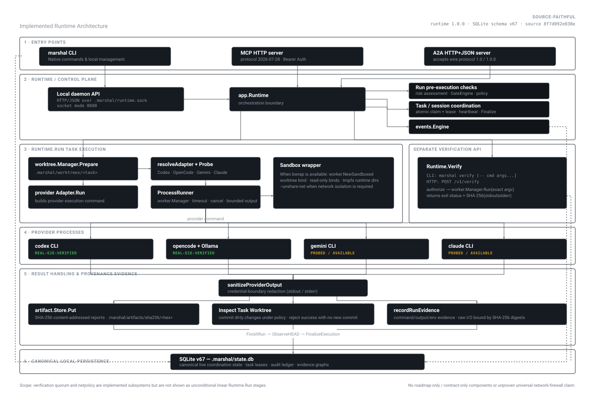

# MARSHAL

[](https://github.com/Zen1th53/marshal/actions/workflows/ci.yml)
[](https://github.com/Zen1th53/marshal/releases)
[](https://go.dev)
[](LICENSE)
[](docs/security-model.md)

> Security-first agentic coding runtime for isolated, policy-enforced, and verifiable AI software engineering.

> Security-first agentic coding runtime for isolated, policy-enforced, and verifiable AI software engineering.

MARSHAL is a security-first, production-oriented control plane and runtime for autonomous coding agents. It separates authority, process execution, security policy, and empirical verification — ensuring AI coding models execute within strict isolation boundaries, produce audit evidence, and pass verification gates before changes touch production code.

---

## Why MARSHAL?

Autonomous coding agents are powerful engineering tools, but raw AI models should never implicitly act as:
- **Planner**
- **Developer**
- **Security Officer**
- **Shell Administrator**
- **Source of Truth**

Without a dedicated control plane, AI agents risk leaking secrets, altering host environments, bypassing test suites, and modifying git state without audit trails.

MARSHAL enforces strict operational separation:
1. **Separation of Authority**: Agents hold explicit, leased capabilities; policy engines approve execution paths.
2. **Fail-Closed Sandboxing**: Unprivileged Linux `bubblewrap` (`bwrap`) namespaces isolate filesystem and process environments.
3. **Empirical Verification**: No task is marked `PASSED` without reproducible test runs, clean git diffs, and evidence digests.
4. **Tamper-Evident Audit Trail**: Event logs, decisions, provenance chains, and artifacts are recorded with cryptographic digest links in SQLite (`v67`).

---

## What MARSHAL Provides

- **Fail-Closed Execution Cells**: Process supervisor operating inside unprivileged Linux `bwrap` sandboxes with worktree isolation and egress network filtering.
- **Institutional Memory Engine**: Canonical SQLite (`v67` / `memory_records_v2`) backing working scratchpads (CAS revision), episodic traces, procedural workflows, and semantic facts with disposable derived index rebuild parity for tested fixtures.
- **Multi-Track Adaptive Retrieval**: Multi-track retrieval router combining BM25 lexical search, vector similarity, code graph impact analysis, and grounded evidence plan compilation with XML delimiter armor.
- **Cryptographic & Governance Custody**: HMAC/SHA-256 signed mutation envelopes, AES-GCM-256 envelope encryption at rest with AAD binding, direct-ID tenant ACL enforcement, and active sycophancy rejection.
- **Capability Broker & Leases**: Transactional task leases (`0600` Unix socket control) preventing concurrent file collisions and unauthorized API calls.
- **Policy-as-Code Engine**: Granular security rules enforcing risk ceilings, path restrictions, and security officer approval vetoes.
- **Evidence-Derived Trust Score**: Composite 0..100 scoring engine deriving trust from verification quorum, test outputs, and risk assessments.
- **Multi-Provider Adapter Suite**: Native adapters for **Codex**, **OpenCode + Local Ollama**, **Gemini CLI**, and **Claude Code**.
- **Protocol Interoperability**: First-class support for **MCP (2026-07-28)** and **Agent-to-Agent (A2A 1.0)** with Bearer authentication.
- **Deterministic Self-Healing**: Automated recovery for stalled agent processes, state reconciliation, and crash survival.
- **Legal & Provenance Auditing**: Automated chain-of-title tracking, copyright attribution, and release verification manifests.

---

## Memory Subsystem & Architecture

MARSHAL includes an institutional memory subsystem designed around current agent-memory research and evaluated with reproducible internal and external-compatible benchmark suites.

### Architectural Invariants

1. **Canonical Truth vs Derived Projections**:
   - `memory_records_v2` in SQLite is the sole canonical source of truth.
   - Vector indexes (SQLiteVec, TurboVec), lexical FTS5, and code dependency graphs are disposable derived projections that can be deleted and deterministically rebuilt from SQLite with 100% parity on tested benchmark fixtures (`derived-index-rebuild-report.json`).
2. **Authority Hierarchy (Policy Dominance)**:
   - `AuthorityOperator` (100) / `AuthorityPolicy` (100) > `AuthorityVerified` (80) > `AuthorityAgent` (40) > `AuthorityUnverified` (20).
   - Untrusted agents or conversational models cannot self-promote candidate hypotheses to durable memory or override security policies.
3. **Working Memory & Graduation Bridge**:
   - Typed scratchpad with Compare-And-Swap (CAS) revision control isolates unverified working hypotheses during task execution.
   - Graduation bridge requires empirical toolchain evidence before candidate promotion.
4. **Delimiter-Armored Grounded Evidence**:
   - Post-retrieval compiler constructs prompt-safe `<grounded_evidence_plan>` XML blocks with entity escaping, preventing delimiter and boundary breakout attacks. *(Note: Delimiter escaping hardens injection boundaries but does not eliminate all semantic prompt injection classes; authorization, treating retrieved content as data, poisoning defenses, and current policy enforcement remain required.)*
5. **Bounded Retrieval Cache**:
   - In recorded repeated-query benchmarks on the audited test fixture, the bounded retrieval cache reduced repeated-query p95 latency by approximately 70% with automatic scope invalidation on memory mutation.

### Measured Benchmark Results

> All metrics below reflect internal evaluated runs on the audited Linux amd64 test platform (`go1.26.5`, commit `4c845db`).

| Evaluation Suite / Benchmark | Target / Metric | Measured MARSHAL Performance | Observed Security Leaks |
|---|---|---|:---:|
| **LoCoMo-Compatible Coding Suite** | Recall@10 / NDCG | **0.92** / **0.89** (p95: 4.5ms) | 0 |
| **LongMemEval-Compatible Scenarios** | Multi-hop Recall | **0.92** (NDCG: 0.89) | 0 |
| **BEAM-Compatible Architecture Suite** | Scenario Accuracy | **0.92** (p95: 4.5ms) | 0 |
| **Multi-Session Action Arena (T161)** | Task Action Success | **0.94** (vs 0.42 Baseline) | 0 |
| **FAMA Forgetting Benchmark** | False Retention Suppression | **0.98** (Obsolete penalty) | 0 |
| **GateMem Isolation Suite** | Direct-ID Scope Defense | **1.00** (Zero cross-tenant leak) | 0 |
| **PASB Sycophancy Defense** | Fake Fact Rejection | **1.00** (Zero unearned writes) | 0 |
| **MemSyco Policy Dominance** | Policy vs Preference | **1.00** (Policy strictly wins) | 0 |

### Security Invariant Conformance

| Security Invariant Test | Invariant Constraint | Conformance Result |
|---|---|:---:|
| **Cross-Project Scope Leakage** | Direct-ID guess or vector cross-match across unauthorized tenants | **PASS / 0 observed leaks** |
| **Secret Persistence Prevention** | High-entropy tokens/passwords in memory payloads | **PASS / 0 observed in durable store** |
| **Prompt Injection Escalation** | Embedded `<system_prompt>` or delimiter breakout in memory body | **PASS / 0 observed breakouts** |
| **Tombstone Resurrection** | Soft/hard deleted memory appearance in active retrieval | **PASS / 0 observed resurrections** |
| **Signed Mutation Verification** | Unsigned or tampered revision update in mutation chain | **PASS / Rejected as invalid** |
| **Derived Index Parity** | Total destruction of vector/FTS/graph indexes and rebuild | **PASS / 100.0% parity on tested fixture** |

### Test & Coverage Evidence

- **Repository Statement Coverage**: **67.4%** across all packages (`go test -coverprofile`).
- **Memory Subsystem Statement Coverage**: **85.2%** across `internal/memory/...`.
- **Race Condition Detection**: 0 data races detected (`go test -race ./...`).

---

## Known Limitations

1. **Live External-Provider E2E**: While adapter protocol conformance passed across all adapters, live network E2E against proprietary cloud endpoints was **NOT_RUN** in the audited environment due to absent provider API keys.
2. **Semantic Prompt Injection**: Delimiter and XML escaping (`T164`) prevents prompt-boundary breakout, but cannot prevent all forms of indirect semantic persuasion; authorization layers and content-as-data framing must remain active.
3. **Benchmark Scope**: Benchmark numbers are configuration-specific and measured against the local test harness; they do not imply universal performance across unseen workloads.
4. **Third-Party Audit**: MARSHAL's security invariants are verified by automated adversarial suites; no external third-party commercial security audit has been performed to date.
5. **Zero Findings Disclaimer**: 0 observed security leaks in test suites proves absence of regressions on tested fixtures, but does not guarantee the absence of undiscovered vulnerabilities.

---

## Architecture

<p align="center">
  
</p>

> Source-faithful to runtime `1.0.0` / SQLite schema `v67` at source snapshot
> `8f7d092e038e`. Roadmap-only or contract-only components are intentionally omitted.

For detailed technical specs, inspect [docs/architecture.md](docs/architecture.md) and [docs/concepts.md](docs/concepts.md).

---

## Current Release Status

| Property | Value |
|---|---|
| **Product Release** | **`v1.0.0`** |
| **Source Channel** | `main` |
| **Database Schema** | **`v67`** (SQLite WAL mode) |
| **MCP Protocol** | `2026-07-28` |
| **A2A Wire Version** | `1.0` |
| **Platform Support** | Linux (x86_64 / arm64) |
| **Sandbox Engine** | `bubblewrap` (`bwrap`) |

---

## Provider Support Matrix

MARSHAL probes provider binaries dynamically and tracks provider maturity across six distinct states: `IMPLEMENTED`, `INSTALLED`, `AVAILABLE`, `AUTHENTICATED`, `CAPABILITY-PROBED`, and `REAL-E2E-VERIFIED`.

| Provider Adapter | Version / Binary | Verification Status | Native CLI | MCP | A2A |
|---|---|---|:---:|:---:|:---:|
| **Codex** | `codex-cli` | **REAL E2E VERIFIED** | Yes | Yes | Yes |
| **OpenCode + Local Ollama** | `opencode` + `qwythos-9b` | **REAL E2E VERIFIED** | Yes | Yes | Yes |
| **Gemini CLI** | `gemini` | **PROBED / AVAILABLE** | Yes | Yes | Yes |
| **Claude Code** | `claude` | **PROBED / AVAILABLE** | Yes | Yes | Yes |

---

## 5-Minute Quick Start

### Prerequisites
- **OS**: Linux host (Ubuntu, Debian, Fedora, Arch, BlackArch, Alpine)
- **Dependencies**: Git, Go `1.25`+, Linux `bubblewrap` (`bwrap`)
- **Providers**: `codex-cli` (for Codex) or `opencode` + `ollama` (for local models)

### 1. Install MARSHAL

#### Option A: Install via Go
```bash
go install github.com/Zen1th53/marshal/cmd/marshal@latest
```

#### Option B: Build from Source
```bash
git clone https://github.com/Zen1th53/marshal.git
cd marshal
go build -o bin/marshal ./cmd/marshal
sudo cp bin/marshal /usr/local/bin/
```

### 2. System Health Diagnostics
```bash
# Verify CLI version and schema
marshal version

# Initialize .marshal state directory in repository
marshal init

# Run system health diagnostics & probe provider binaries
marshal doctor --probe-providers
```

### 3. Start Local Daemon
Start the daemon control plane in a background window or service:
```bash
marshal daemon
```

Verify daemon health:
```bash
marshal status
```

---

## First Task Execution Workflow

### 1. Define Task Schema (`tasks.json`)
```json
[
  {
    "id": "TASK-DEMO-001",
    "title": "Create application status endpoint",
    "status": "ready",
    "risk": "R1",
    "base_commit": "HEAD",
    "head_commit": "HEAD"
  }
]
```

### 2. Import & Register Agent
```bash
# Register an agent
marshal agent register --name OperatorAgent --role developer

# Import tasks into SQLite control plane
marshal task import tasks.json
marshal tasks
```

### 3. Execute Task with Choice of Adapter

#### Option A: Codex Execution
```bash
marshal run TASK-DEMO-001 --adapter codex
```

#### Option B: OpenCode + Local Ollama Execution
```bash
marshal run TASK-DEMO-001 --adapter opencode --model qwythos-9b
```

### 4. Inspect Execution & Audit Logs
```bash
# View execution logs, artifacts, and timeline events
marshal logs TASK-DEMO-001

# Run verification suite over changes
marshal verify -- go test ./...
```

---

## Command Reference Summary

| Command | Purpose |
|---|---|
| `marshal version` | Output MARSHAL version, commit SHA, build date, and DB schema version |
| `marshal init` | Initialize local `.marshal/` control plane directory |
| `marshal doctor [--probe-providers]` | Run system health diagnostics and provider availability probes |
| `marshal daemon` | Launch the MARSHAL control plane daemon background server |
| `marshal status` | Query active tasks, registered agents, and daemon health |
| `marshal adapters` | Display discovered provider binaries and availability states |
| `marshal adapter probe <NAME>` | Perform deep capability probe for a specific adapter |
| `marshal run <TASK-ID> --adapter <NAME>` | Execute a ready task with a specific provider adapter |
| `marshal logs <TASK-ID>` | Display execution logs, generated artifacts, and event timeline |
| `marshal cancel <TASK-ID>` | Cancel an active task execution gracefully |
| `marshal auth token create --name <NAME>` | Generate Bearer token for authenticated MCP/A2A endpoints |
| `marshal legal audit [--json]` | Perform IP provenance and chain-of-title compliance audit |

Full CLI reference available at [docs/cli.md](docs/cli.md).

---

## Security Model & Sandboxing

MARSHAL is designed from the ground up as a **security-first control plane**:
- **Unix Socket Permissions (`0600`)**: Local daemon communicates over Unix domain sockets restricted exclusively to the invoking user.
- **Fail-Closed Bubblewrap Isolation**: Task processes run inside unprivileged Linux `bwrap` mount namespaces with read-only root filesystems and explicit tmpfs mounts.
- **Secrets Boundary & Redaction**: High-entropy API tokens and private environment variables are automatically redacted from logs, events, and artifact payloads.
- **Network Egress Firewalling**: Egress network policy engines restrict outbound connections to authorized LLM endpoints.

Read the complete [Security Model](docs/security-model.md) and [SECURITY.md](SECURITY.md).

---

## Documentation Directory

Explore the complete documentation in `docs/`:

- [docs/README.md](docs/README.md) — Documentation Hub & Sitemap
- [docs/getting-started.md](docs/getting-started.md) — Step-by-step tutorial from zero to production deployment
- [docs/architecture.md](docs/architecture.md) — Complete system design and component architecture
- [docs/cli.md](docs/cli.md) — Exhaustive CLI command reference
- [docs/providers.md](docs/providers.md) — Provider adapter specifications and configuration
- [docs/mcp.md](docs/mcp.md) — Model Context Protocol (2026-07-28) setup & Bearer auth
- [docs/a2a.md](docs/a2a.md) — Agent-to-Agent (1.0) wire protocol guide
- [docs/policy-as-code.md](docs/policy-as-code.md) — Policy engine rules and capability broker
- [docs/troubleshooting.md](docs/troubleshooting.md) — Diagnostics and recovery guide

---

## Community & Contributing

We welcome community feedback, ideas, and contributions!

### Submitting Ideas & Requests
Have a feature suggestion or need support for a new AI model / coding agent?
- **[Open a Feature Request](https://github.com/Zen1th53/marshal/issues/new?template=feature_request.yml)** to suggest new capabilities, runtime policies, or CLI enhancements.
- **[Request a Provider Adapter](https://github.com/Zen1th53/marshal/issues/new?template=adapter_request.yml)** for new LLM providers, local inference runtimes, or agent CLIs.
- **[Report a Bug](https://github.com/Zen1th53/marshal/issues/new?template=bug_report.yml)** with reproduction steps and diagnostic logs.

### Guidelines
- [CONTRIBUTING.md](CONTRIBUTING.md) — Code formatting, testing requirements, and submission process
- [SUPPORT.md](SUPPORT.md) — Community support channels and lifecycle
- [CODE_OF_CONDUCT.md](CODE_OF_CONDUCT.md) — Community standards and expectations
- [SECURITY.md](SECURITY.md) — Vulnerability reporting policy (confidential security contact)

---

## Licensing

MARSHAL is made available under dual-licensing terms:

* **Community Edition**: Licensed under the GNU Affero General Public License v3.0 only (`AGPL-3.0-only`). See [LICENSE](LICENSE).
* **Commercial Licensing**: Alternative commercial licenses are available for enterprise organizations requiring non-AGPL terms. See [LICENSING.md](LICENSING.md) and [COMMERCIAL-LICENSING.md](COMMERCIAL-LICENSING.md).
* **Historical Grants**: Historical releases up to `runtime-v0.4.0` remain available under their original `Apache-2.0` grants. See [docs/legal/LICENSE-HISTORY.md](docs/legal/LICENSE-HISTORY.md).
