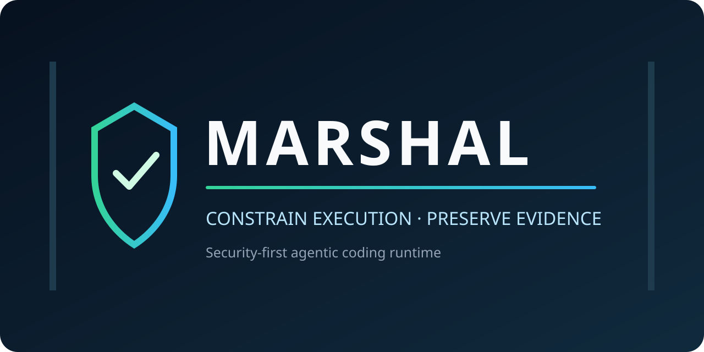
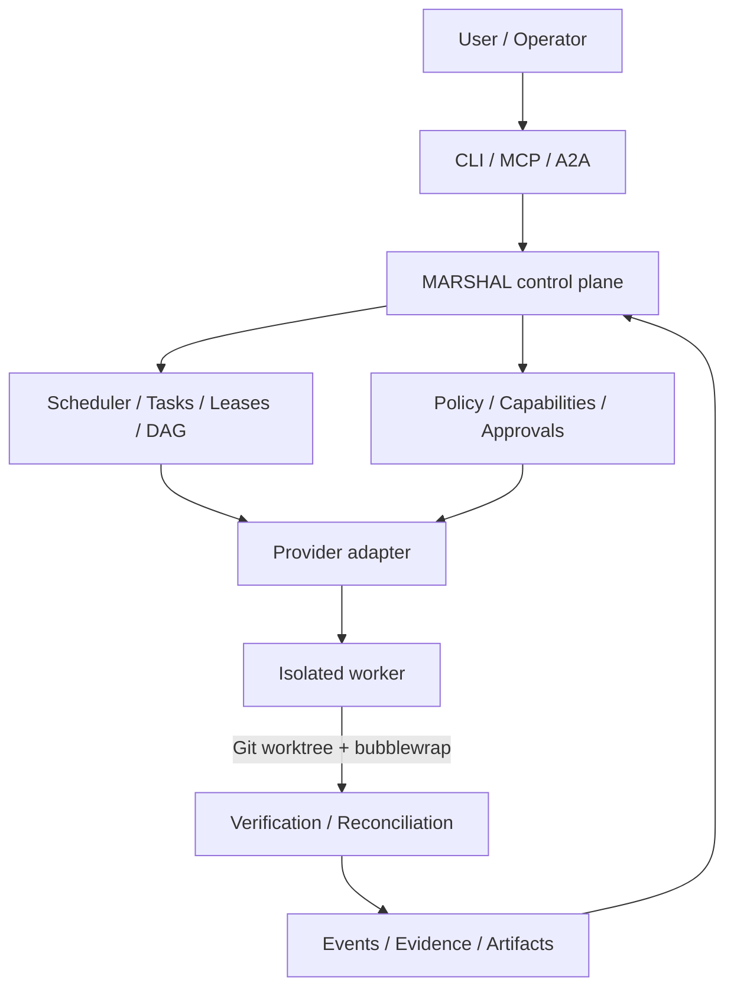

# MARSHAL

<p align="center">
  
</p>

**Security-first agentic coding runtime for isolated, policy-enforced, and verifiable software engineering.**

MARSHAL separates an AI coding agent's ability to propose and execute work from
the authority to approve, verify, or trust that work.

[](https://github.com/Zen1th53/marshal/actions/workflows/ci.yml)
[](https://github.com/Zen1th53/marshal/releases/latest)
[](go.mod)
[](docs/installation.md)
[](LICENSING.md)

> Move fast. Grant less. Verify everything.

## Why MARSHAL

An autonomous coding model should not implicitly become the planner,
developer, approver, security authority, shell administrator, and source of
truth at the same time. MARSHAL introduces a local control plane between an
agent and a Git repository so those responsibilities can be enforced as
separate, auditable operations.

MARSHAL is not a claim that AI output is trustworthy. It is infrastructure for
constraining execution, requiring evidence, and making trust decisions explicit.

## What MARSHAL provides

- **Task orchestration:** durable tasks, dependency DAGs, leases, ownership,
  lifecycle transitions, recovery, and reconciliation.
- **Execution isolation:** task-specific Git worktrees and fail-closed Linux
  sandbox integration through bubblewrap.
- **Authority boundaries:** explicit roles, scoped capabilities, policy gates,
  approvals, network egress controls, and destructive-operation risk checks.
- **Provider-neutral adapters:** Codex, Claude Code, Gemini CLI, and OpenCode
  process adapters behind one runtime contract.
- **Verification:** evidence-bound test execution, quorum decisions,
  cross-model review contracts, policy conformance, and merge gates.
- **Evidence and artifacts:** structured events, provenance, immutable digests,
  audit history, artifact records, trust scoring, and release pack validation.
- **Interoperability:** authenticated MCP `2026-07-28` and A2A `1.0.0`
  interfaces mapped onto the same runtime authority model.
- **Operations:** local daemon, SQLite state, CLI diagnostics, logs,
  cancellation, observability, and backup/recovery guidance.

Every item above is represented in the merged implementation and automated test
suite. External provider availability and authentication remain properties of
the operator's environment.

## Architecture



The runtime remains local-first. SQLite stores canonical control-plane state;
Git stores source truth; event, evidence, and artifact records bind decisions to
the source and runtime state that produced them.

See [Architecture](docs/architecture.md), [Execution Cells](docs/execution-cells.md),
and the [Security Model](docs/security-model.md).

## Trust model

MARSHAL enforces a control plane; it does not make models, provider output, or
the local machine inherently safe.

- A worktree separates changes; bubblewrap supplies the Linux security boundary.
- Possessing a tool does not grant authority to use it.
- Provider identity and model labels do not grant permissions.
- Policy, test results, metrics, and historical evidence are not themselves
  authorization capabilities.
- The host owner remains responsible for kernel, filesystem, provider
  credentials, and deployment trust.

Read [SECURITY.md](SECURITY.md) before using MARSHAL with sensitive repositories.

## Install

MARSHAL supports Linux on amd64 and arm64. Go `1.25.13` or newer is required for source
installation; bubblewrap is required for strong worker isolation.

### Binary release

```bash
version=1.0.1
arch=amd64  # or arm64
curl -LO "https://github.com/Zen1th53/marshal/releases/download/v${version}/marshal_${version}_linux_${arch}.tar.gz"
curl -LO "https://github.com/Zen1th53/marshal/releases/download/v${version}/checksums.txt"
sha256sum -c --ignore-missing checksums.txt
tar -xzf "marshal_${version}_linux_${arch}.tar.gz"
install -Dm755 marshal "$HOME/.local/bin/marshal"
marshal version
```

### Go install

```bash
go install github.com/Zen1th53/marshal/cmd/marshal@v1.0.1
marshal version
```

See [Installation](docs/installation.md) for dependencies and artifact
verification.

## Five-minute start

Run these commands inside a Git repository. `marshal init` creates missing
project contracts with fail-closed defaults and never overwrites existing ones.
The repository must have a valid Git author name and email so MARSHAL can create
the task commit.

```bash
git config user.name
git config user.email
marshal init
marshal doctor
marshal adapters
```

Start the local daemon in one terminal:

```bash
marshal daemon
```

In another terminal, register an explicitly scoped agent and import a task:

```bash
marshal agent register --name operator-agent --role developer

cat > tasks.json <<'JSON'
[
  {
    "id": "TASK-DEMO-001",
    "title": "Add a repository status document",
    "status": "ready",
    "risk": "R1",
    "base_commit": "HEAD",
    "head_commit": "HEAD"
  }
]
JSON

marshal task import tasks.json --dry-run
marshal task import tasks.json
marshal tasks
```

Execute with a provider that is installed and authenticated in your environment:

```bash
marshal run TASK-DEMO-001 --adapter codex --network-required
# or
marshal run TASK-DEMO-001 --adapter opencode --model YOUR_TOOL_CAPABLE_MODEL --network-required

marshal logs TASK-DEMO-001
marshal events
marshal artifacts
```

The deterministic [policy-test example](examples/policy-test-suite.json) can be
run without external provider credentials:

```bash
marshal policy test examples/policy-test-suite.json
```

## Provider support

| Adapter | Implemented and contract-tested | Local availability check | Fresh external E2E status |
|---|:---:|---|---|
| Codex | Yes | `marshal adapter probe codex` | Operator credentials required; not part of the hermetic release gate |
| OpenCode | Yes | `marshal adapter probe opencode` | Verified 2026-08-18 with OpenCode 1.18.4 and local Ollama `qwythos-9b`; environment-specific |
| Gemini CLI | Yes | `marshal adapter probe gemini` | Not verified for this release because quota/authentication is external |
| Claude Code | Yes | `marshal adapter probe claude` | Not verified for this release because authentication is external |

`IMPLEMENTED`, `INSTALLED`, `AVAILABLE`, `AUTHENTICATED`,
`CAPABILITY-PROBED`, and `REAL-E2E-VERIFIED` are deliberately distinct states.
See [Provider Adapters](docs/providers.md) and
[OpenCode with Ollama](docs/providers/opencode-ollama.md).

## Security

MARSHAL's security controls include:

- least-privilege role and capability enforcement;
- task-scoped worktrees and Linux sandbox policy;
- authenticated MCP and A2A entry points;
- policy-as-code and policy conformance tests;
- secret-boundary sanitization and bounded audit data;
- artifact digests, provenance records, and release checksums;
- fail-closed handling of missing policy, authority, or verification evidence.

These controls reduce risk; they do not replace host hardening, credential
management, code review, or deployment policy. Report vulnerabilities privately
using [SECURITY.md](SECURITY.md), not a public issue.

## Documentation

| Start here | Reference and operations |
|---|---|
| [Documentation portal](docs/README.md) | [CLI reference](docs/cli.md) |
| [Getting started](docs/getting-started.md) | [Provider adapters](docs/providers.md) |
| [Installation](docs/installation.md) | [MCP](docs/mcp.md) / [A2A](docs/a2a.md) |
| [Architecture](docs/architecture.md) | [Troubleshooting](docs/troubleshooting.md) |
| [Security model](docs/security-model.md) | [Upgrade and migration](docs/operations/upgrades.md) |
| [Examples](examples/README.md) | [Release process](docs/development/release-process.md) |

## Release and compatibility status

`v1.0.1` is the current MARSHAL patch release. It hardens the first stable
release with verified build metadata, deterministic Linux packaging, a complete
release gate, and fixes found during clean-user provider execution. All planned
T01-T55 implementation epics are merged.

The repository also carries pack contract version `6.0.0` and runtime
specification version `1.0.0`; these are not product release numbers. Historical
`runtime-v0.x` releases remain available under their original license grants.
See [CHANGELOG.md](CHANGELOG.md) and [Licensing](LICENSING.md).

## Contributing and support

Read [CONTRIBUTING.md](CONTRIBUTING.md) before opening a pull request. Bug and
usage support paths are documented in [SUPPORT.md](SUPPORT.md). Security reports
must follow [SECURITY.md](SECURITY.md).

## License

The current open-source release is licensed under
[AGPL-3.0-only](LICENSE). Commercial licensing is available under separate
terms; see [LICENSING.md](LICENSING.md). Previously published Apache-2.0
versions retain their historical grants.
